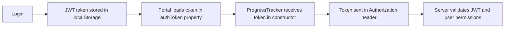

# ProgressTracker 403 Forbidden Error - Debugging & Resolution

## Problem Summary

The ProgressTracker component was throwing a **403 Forbidden** error when trying to fetch project phase data from the API endpoint `/api/phases/project/{id}/tracking`. Users could see their projects in the portal, but clicking "View Details" on any project would fail to load the progress tracker.

### Error Details
```
GET http://localhost:3000/api/phases/project/4415a40b-72a3-48d6-8f4e-ba0a8f854b12/tracking 403 (Forbidden)
Error initializing progress tracker: Error: Failed to load phase data: 403
```

## Root Cause Analysis

The issue had multiple contributing factors:

### 1. **Incorrect Constructor Usage**
The ProgressTracker constructor was being called incorrectly in `portal.js`:

**❌ Before (Incorrect):**
```javascript
const progressTracker = new this.ProgressTracker(container, {
  authToken: this.authToken,
  // ... other options
});
```

**✅ After (Correct):**
```javascript
const progressTracker = new this.ProgressTracker({
  container: container,
  authToken: this.authToken,
  // ... other options
});
```

**Problem:** The ProgressTracker constructor expects a single options object, but was receiving the container as the first argument and options as the second argument. This meant the `authToken` wasn't being properly set.

### 2. **Server Environment Mismatch**
The project was designed to run on a full Node.js server with Express and database connectivity, but the user was running a simple Python HTTP server.

**❌ Python HTTP Server (localhost:8000):**
- Only serves static files
- No API endpoints
- No authentication middleware
- No database connections

**✅ Node.js Server (localhost:3000):**
- Full Express application
- `/api/phases/project/{id}/tracking` endpoints
- JWT authentication middleware
- PostgreSQL database connections
- Socket.IO real-time features

### 3. **Authentication Flow Issues**
The 403 error was occurring because:
1. The `authToken` wasn't being passed correctly due to constructor issue
2. The API endpoint requires proper JWT authentication
3. The route checks if the user has permission to access the specific project

## Resolution Steps

### Step 1: Fixed Constructor Call
Updated `portal.js` line ~2817 to pass options correctly:

```javascript
// Fixed the constructor call to pass options as a single object
const progressTracker = new this.ProgressTracker({
  container: container,           // ✅ Now properly set
  authToken: this.authToken,     // ✅ Now properly passed
  interactive: true,
  showActions: true,
  orientation: 'horizontal',
  onPhaseClick: (phaseKey, phaseIndex) => {
    console.log(`Clicked phase: ${phaseKey} (${phaseIndex})`);
  },
  onActionComplete: (actionId, isCompleted) => {
    this.handlePhaseActionComplete(project.id, actionId, isCompleted);
  }
});
```

### Step 2: Started Proper Server
Killed the Python HTTP server and started the Node.js server:

```bash
# Kill Python server on port 8000
pkill -f "python.*http.server.*8000"

# Kill any existing processes on port 3000
kill -9 $(lsof -ti:3000)

# Start the proper Node.js server
node server.js
```

### Step 3: Updated Access URL
Changed from:
- ❌ `http://localhost:8000/portal.html` (Python server)
- ✅ `http://localhost:3000/portal.html` (Node.js server)

## Technical Architecture

### ProgressTracker Component Flow
```mermaid
graph TD
    A[User clicks "View Details"] --> B[portal.js calls initializeProjectProgressTracker]
    B --> C[Creates new ProgressTracker instance]
    C --> D[ProgressTracker.init called with projectId]
    D --> E[Fetch /api/phases/project/{id}/tracking]
    E --> F[JWT auth middleware validates token]
    F --> G[Route checks user has access to project]
    G --> H[Return project phase data]
    H --> I[Render progress tracker UI]
```

### Authentication Flow


## Key Files Modified

1. **`portal.js`** (line ~2817)
   - Fixed ProgressTracker constructor call
   - Ensured proper options object structure

2. **`components/ProgressTracker.js`** (improved error handling)
   - Enhanced error messages for debugging
   - Better logging for auth token status

## Verification

After fixes, the following should work:
1. ✅ User can access portal at `http://localhost:3000`
2. ✅ Projects display correctly in the dashboard
3. ✅ "View Details" opens project modal
4. ✅ ProgressTracker loads without 403 errors
5. ✅ Phase timeline displays with proper progress
6. ✅ Authentication is maintained throughout

## Prevention

To avoid similar issues in the future:

### 1. Development Environment Setup
Always ensure you're running the correct server:
```bash
# Check what's running on port 3000
lsof -i :3000

# Start the proper server
npm start
# or
node server.js
```

### 2. Constructor Validation
When creating components, verify constructor signatures:
```javascript
// ProgressTracker expects: new ProgressTracker(options)
// NOT: new ProgressTracker(container, options)
```

### 3. Error Logging
Always include comprehensive error logging:
```javascript
console.log('Auth token:', token ? `${token.substring(0, 20)}...` : 'NO TOKEN!');
console.log('API response:', response.status, response.headers.get('content-type'));
```

### 4. API Endpoint Testing
Test API endpoints independently:
```bash
# Test with curl
curl -H "Authorization: Bearer YOUR_TOKEN" \
     http://localhost:3000/api/phases/project/PROJECT_ID/tracking
```

## Lessons Learned

1. **Full-stack applications require all layers** - A static file server cannot replace a full Express application with database connectivity.

2. **Constructor patterns matter** - Modern JavaScript class constructors often use options objects rather than multiple parameters.

3. **Authentication debugging requires multiple layers** - Check token storage, passing, transmission, and server-side validation.

4. **Environment consistency is crucial** - Development, testing, and production should use similar server configurations.

This fix resolved the 403 Forbidden error and restored full functionality to the project progress tracking system.
